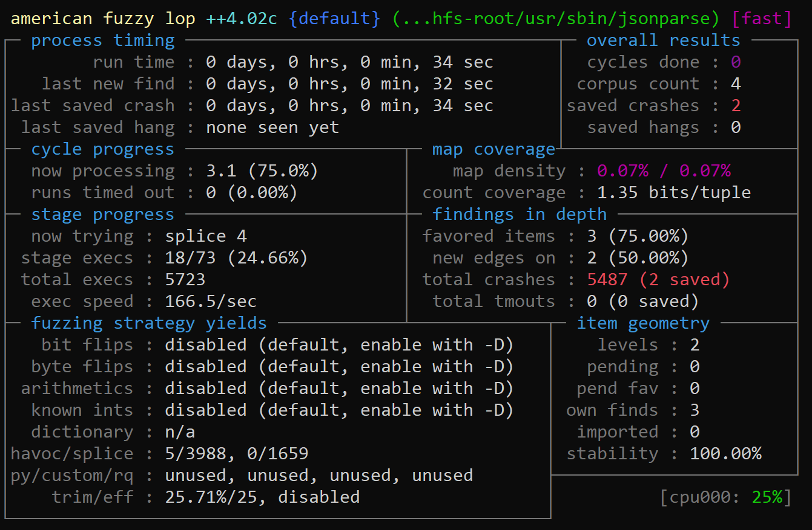
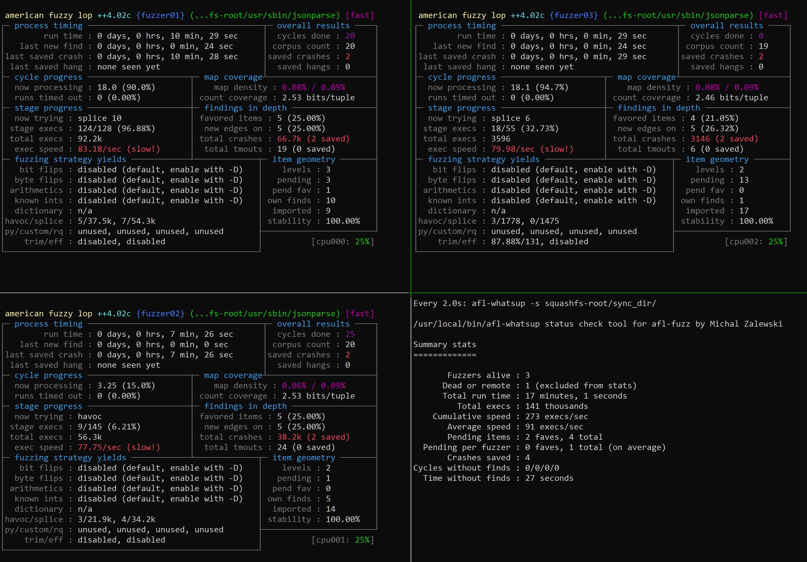

# Fuzzing `RV215W`

`RV215W` is a small wireless router from `Cisco`, as described in there website 

[Cisco website]: https://www.cisco.com/c/en/us/products/collateral/routers/rv215w-wireless-n-vpn-router/data_sheet_c78-712088.html	"Cisco website"


### Examining the target

First thing first, let's look at one of the firmware located in our target directory.

We start with the binary blob `RV215W_FW_1.3.1.7.bin`, that we can examine with `binwalk` :

````bash
$ binwalk RV215W_FW_1.3.1.7.bin

DECIMAL       HEXADECIMAL     DESCRIPTION
--------------------------------------------------------------------------------
32            0x20            TRX firmware header, little endian, image size: 11018240 bytes, CRC32: 0x7F23D367, flags: 0x0, version: 1, header size: 28 bytes, loader offset: 0x1C, linux kernel offset: 0x183C90, rootfs offset: 0x0
60            0x3C            LZMA compressed data, properties: 0x5D, dictionary size: 65536 bytes, uncompressed size: 4481156 bytes
1588400       0x183CB0        Squashfs filesystem, little endian, non-standard signature, version 3.0, size: 9425813 bytes, 1182 inodes, blocksize: 65536 bytes, created: 2020-05-15 00:48:58
```
````

Then we can extract the `squashfs` file system with `binwalk`and get the following :

````bash
$ binwalk -Mre RV215W_FW_1.3.1.7.bin
$ ls _RV215W_FW_1.3.1.7.bin.extracted/squashfs-root
bin  data  dev  etc  lib  mnt  proc  sbin  sys  tmp  usr  var  www

_RV215W_FW_1.3.1.7.bin.extracted/squashfs-root$ readelf -h bin/busybox
ELF Header:
  Magic:   7f 45 4c 46 01 01 01 00 00 00 00 00 00 00 00 00
  Class:                             ELF32
  Data:                              2's complement, little endian
  Version:                           1 (current)
  OS/ABI:                            UNIX - System V
  ABI Version:                       0
  Type:                              EXEC (Executable file)
  Machine:                           MIPS R3000
  Version:                           0x1
```

````

### Preparing our tools

Now we know we are targeting little endian MIPS binaries. Now let's try to execute a binary using `qemu user mode`. There is a `JSON` parsing binary there located in `/usr/sbin/jsonparse`.

```bash
$ sudo apt install qemu-user-static
$ cd _RV215_FW_1.3.1.7.bin.extracted/squashfs-root
$ qemu-mipsel-static -L . ./bin/busybox
squashfs-root$ qemu-mipsel-static -L . ./usr/sbin/jsonparse

usage: jsonparse [file]
...
```


Now that we have a pretty good target binary that takes a file as input, we can use our familiar `AFL` fuzzer in `QEMU` mode. Last thing we need to make sure of is to have the correct version of support for `afl-qemu-trace`, we can do it by recompiling the support as :


````bash
AFLPlusPlus$ cd qemu_mode
AFLPlusPlus/qemu_mode$ CPU_TARGET=mipsel ./build_qemu_support.sh
AFLPlusPlus$ sudo make install #not necessary, but more convenient not to have long paths in command

```
````

Now let's create both input and out directories for `AFL` , move a minimal json file into the input directory :


````bash
$ mkdir ./squashfs-root/in ./squashfs-root/sync_dir
$ echo '{"fruit": "Apple","size": "Large","color": "Red"}' > ./squashfs-root/in/0
$ 
```
````

### Fuzzing our target

Time to fuzz, with `AFL` :

````bash
$ sudo bash -c 'echo "/data/app_crash/%t.%e.core.%p" > /proc/sys/kernel/core_pattern'
$ QEMU_LD_PREFIX=./squashfs-root/ afl-fuzz -Q -i ./squashfs-root/in/ -o ./squashfs-root/sync_dir/ -- ./squashfs-root/usr/sbin/jsonparse @@

```
````

- `QEMU_LD_PREFIX` is required to make sure our emulator knows which directory to use as a base to find the dynamic libraries
- `-Q` to use `QEMU` mode

The rest of the arguments are now familiar to you.





We see that despite using emulation, we execute at decent speed of 166 exec/s and we already get 2 unique crashes after a few seconds of fuzzing. As previously did, we can add other slaves instance of the same fuzzer, to scale and increase overall speed. Make sure you use `screen` or `tmux` so you can organize your work, and most importantly not lose your session if you are working over a remote server.

````bash
# starting the main fuzzer01 with -M
$ QEMU_LD_PREFIX=./squashfs-root/ afl-fuzz -M fuzzer01 -Q -i ./squashfs-root/in/ -o ./squashfs-root/sync_dir/ -- ./squashfs-root/usr/sbin/jsonparse @@

# adding a second secondary fuzzer02 with -S 
$ QEMU_LD_PREFIX=./squashfs-root/ afl-fuzz -S fuzzer02 -Q -i ./squashfs-root/in/ -o ./squashfs-root/sync_dir/ -- ./squashfs-root/usr/sbin/jsonparse @@

# adding a third secondary fuzzer03 with -S 
$ QEMU_LD_PREFIX=./squashfs-root/ afl-fuzz -S fuzzer03 -Q -i ./squashfs-root/in/ -o ./squashfs-root/sync_dir/ -- ./squashfs-root/usr/sbin/jsonparse @@

# invoking afl-whatsup command with simplified vue, to update every 2 seconds
$ watch -n 2 afl-whatsup -s ./squashfs-root/sync_dir/

```
````

Now we have three instances running in parallel along with a simple monitoring screen to have a overview of how our fuzzer performs. The tool `afl-gotcpu` is a quick way to understand how much more instance you can launch.





### Next move

Now that your first target binary is running, keep it running for a bit and

- Start hunting for other binaries in that firmware
  - Looking in the same `/usr/sbin/` directory is an interesting area. As example we have `usr/sbin/xmlparser1` and `usr/sbin/decode` that could be interesting for example.
- Look for other products of the same brand and check whether they use the same binaries that you potentially found vulnerable
  - In that case, reuse your fuzzing steps against those and leave them running.
- In parallel start analyzing how this potentially vulnerable target can be reached by a user-provided input and verify the exploitability of the couple crashes you already got.


As a second exercise, analyze the `RV130W` VPN router and write harnesses for interesting binaries. We should be able to use almost everything from our previous target, but will need to recompile AFL support to `QEMU`.


QEMU_LD_PREFIX=./squashfs-root/ afl-fuzz -M main_jsonparse -Q -i ./squashfs-root/json_in/ -o ./squashfs-root/json_out/ -- ./squashfs-root/usr/sbin/jsonparse @@

QEMU_LD_PREFIX=./squashfs-root/ afl-fuzz -S s1_jsonparse -Q -i ./squashfs-root/json_in/ -o ./squashfs-root/json_out/ -- ./squashfs-root/usr/sbin/jsonparse @@
